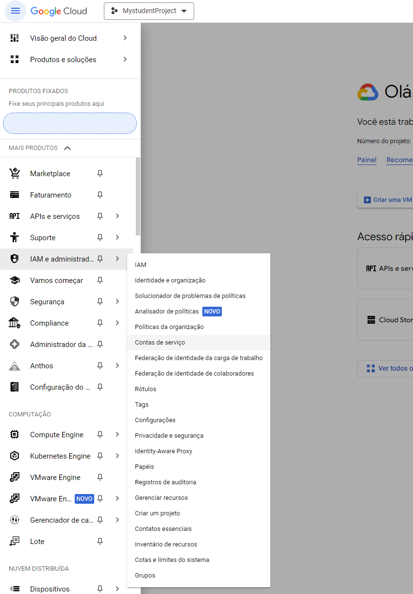
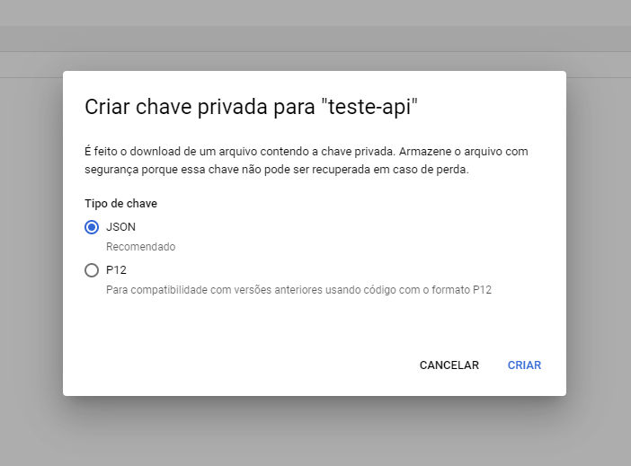
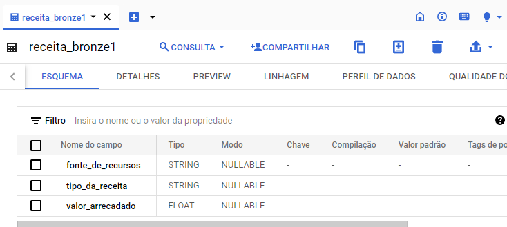
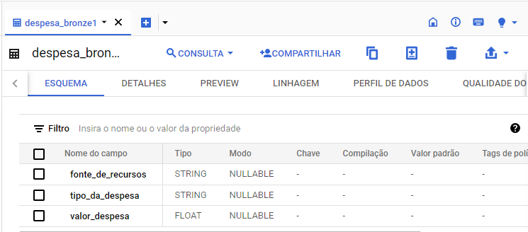
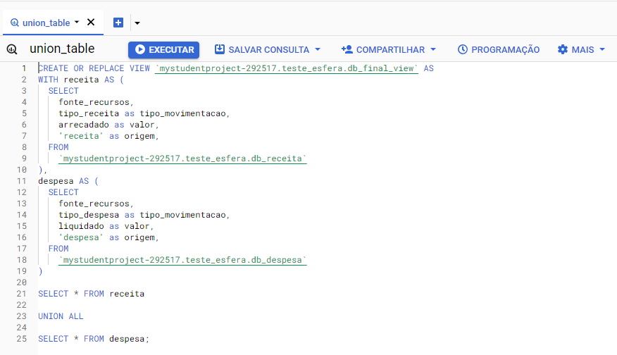

## Teste de engenharia de dados.

### O teste consiste em desenvolver um processo de ETL para processar arquivos CSV e armazenar os dados em um banco de dados junto a uma construção de um painel em alguma ferramenta de dataviz.

### Arquivos para o teste:
- [gdvReceitasExcel.csv](docs/gdvReceitasExcel.csv)
- [gdvDespesasExcel.csv](docs/gdvReceitasExcel.csv)

### Requisitos:

- Adequar os tipos de dados para os mais apropriados.
- Utilizar Python e/ou SQL para processamento dos dados.
- Hospedar o código do projeto e fornecer uma explicação detalhada no GitHub.

### Ferramentas utilizadas: 

- Para leitura e tratamento dos arquivos: Python
- Banco de dados para armazenar: BigQuery
- Para analise dos dados: SQL
- Visualização de dados: Looker Studio
- Hospedagem do código: GitHub

### Entregáveis:

- Criar um painel em uma ferramenta de dataviz para responder quais são as 5 maiores fontes de
recursos e os 5 maiores tipos de despesa.

## Criando o arquivo de conexão json no BigQuery:

### No menu de navegação -> IAM e administrador -> Contas de serviço -> Criar uma nova conta de serviço -> Clicar nos 3 pontos a direita, assim que a conta for criada -> Gerenciar Chaves -> Adicionar CHAVE -> Criar uma nova chave.

### Imagens de exemplo:

### Acessando Contas de serviço:

### Criando chave json e realizando o download:

## Segunda etapa, script para tratar os dados dos arquivos csv e realizar o envio ao BigQuery:

- [Script Python](scripts_python/esfera_v0.ipynb)

### Obs: o script possui comentários para o melhor entendimento do código.

### Esquema das tabelas: 

#### Tabela receita:

#### Tabela despesa:

### Query para juntar as duas tabelas e fazer a view no bigquer: 

- [Script SQL](scripts_sql/union.sql)
  

### Contrução do painel para visualizar os dados e responder as questões propostas pelo teste.

[Acesse o relatório do Looker Studio aqui](https://lookerstudio.google.com/reporting/4aebb778-9b85-46cd-90fb-fdc917af188c)

### Teste finalizado.
